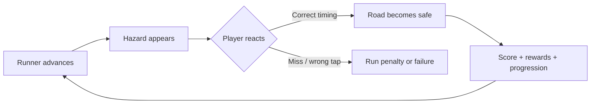

<div align="center">

# PaveTareeq — Build the Run

### A Flutter arcade runner where the player saves the route instead of controlling the runner.


**Arcade Gameplay · Progression Systems · Local Persistence · Audio · Rewarded Ads**

</div>

---

## Game Concept

PaveTareeq flips the usual endless-runner formula: the runner moves automatically, while the player protects the route ahead.

Broken, locked, falling, moving, and warning tiles must be fixed at the right moment before the runner reaches them. Accurate timing creates better rewards; missed hazards or incorrect taps can end the run.

## Gameplay Loop



## Features

- Level-based road-protection gameplay
- Endless mode
- Five themed seasons:
  - Toy City
  - Candy Sky
  - Desert Rush
  - Neon Night
  - Space Road
- Boss-style final levels
- Coins and unlockable skins
- Wardrobe items and road themes
- Perfect saves and last-second saves
- Star ratings and score breakdowns
- Daily rewards and mission tracking
- Background music and sound effects
- Google Mobile Ads integration
- Local progress persistence with `shared_preferences`

## Engineering Structure

```text
lib/
  data/       Game data, seasons, wardrobe catalog
  game/       Arcade view, road/runner painting, particles
  models/     Game, scoring, season, skin, tile, wardrobe models
  screens/    Splash, home, gameplay, selection, result, wardrobe
  services/   Ads, audio, progress, scoring, daily, wardrobe services
  widgets/    Shared UI widgets
```

The project separates gameplay, domain models, screens, services, data, and reusable widgets rather than keeping the entire game in one application file.

## Tech Stack

| Area | Technology |
|---|---|
| Application | Flutter |
| Main language | Dart |
| Android host | Kotlin |
| Generated Android integration | Java |
| Android configuration | XML + Gradle/Kotlin DSL |
| Local persistence | `shared_preferences` |
| Monetization integration | `google_mobile_ads` |
| Audio | `audioplayers` |
| Code quality | `flutter_lints` |

## Run Locally

```bash
flutter pub get
flutter run
```

## Tests

```bash
flutter test
```

## What This Project Demonstrates

- Flutter mobile application development
- Custom arcade game logic and rendering
- State and progression systems
- Service-oriented project organization
- Local persistence
- Audio integration
- Rewarded-ad integration
- Android build/configuration workflow

---

<div align="center">

### Built by Tarek Elsayed

**Computer Science · Flutter · Mobile & Game Development**

[GitHub Profile](https://github.com/tarekkalsayed-pixel)

</div>
